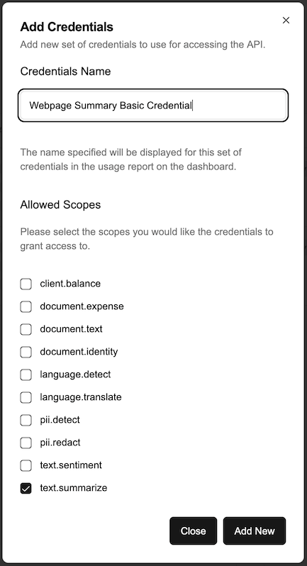

# Summarize a webpage using python

[](https://www.youtube.com/watch?v=Ctdf9mqUEvg)

## Tools used

- Python 3 https://www.python.org/downloads/
- Beautiful Soup 4 https://pypi.org/project/beautifulsoup4/
- Intelligent API https://intelligent-api.com/

## Possible use cases

This sample code could be used to build applications such as:

- Webpage summary application
- Data extraction application

## Overview

This sample code shows how you could use the Intelligent API's Summarize Text endpoint (https://docs.intelligent-api.com/api#text-summarize-text-summarizetext) using python and the Beautiful Soup library to create an application that would summarize webpages.

We used python here as it is most commonly associated with data processing, and this seemed to fit into that use case, however this could be achieved with any programming language using the Intelligent API.

## Getting started

This getting started guide shows you how to create your own version of this application. If you just want to use this code as is, please pull the repository and follow the guide as is but instead of copying the code where indicated you simply need to ensure you replace the relevant settings once you have setup your own versions of them (i.e. Intelligent API Credentials).

### Intelligent API

Follow the Intelligent API Getting Started guide https://docs.intelligent-api.com/docs/gettingstarted to create an account and then create a specific _*Basic Credential*_ with only the `text.summarize` scope specified.

> Be sure to store the `Client Id` and `Client Secret` securely, we will be adding that to the `.env` file later.



### Python Project

Next we created a python project (we have python 3 installed using the terminal) and activated the python environment:

```shell
python -m venv venv
source venv/bin/activate
```

If you are not using the existing repository, you will need to copy the code, so ensure you have the following files:

```shell
python_project_folder/
|-- models/
|   |-- api_response.py
|   |-- cost_calculation.py
|-- main.py
|-- requirements.txt
|-- .gitignore
```

Install the required libraries:

```shell
pip install -r requirements.txt
```

Create an `.env` file in the `python_project_folder` and populate the values with the `CLIENT_ID` and `CLIENT_SECRET` you got when you created the Intelligent API credentials.

## Run the app

Once that is completed you can run the application, passing in the URL of the webpage you would like to summarize:

```shell
python main.py https://docs.intelligent-api.com/docs/introduction
```
